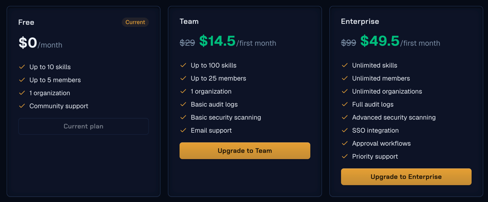

# Централизованные хранилища skills

---

## 1. Хранилища скиллов

Для создания и последующего использования централизованного хранилища для скиллов требуется:

1. **Хранилище / registry** — место, где лежит корпоративный каталог skills, версии, права доступа и история изменений. В роли хранилища выступает GitLab/GitHub либо отдельный registry.
2. **Installer / package manager** — клиент, который берет skill из хранилища и физически устанавливает его в директории Claude Code, Cursor, Codex, Copilot и других агентов.

### Варианты создания хранилищ

| Вариант                              | Что является центральным хранилищем  | Как пользователь ставит skill                                    | Поиск / каталог                                                           | Обновления                                                              |
| ------------------------------------ | ------------------------------------ | ---------------------------------------------------------------- | ------------------------------------------------------------------------- | ----------------------------------------------------------------------- |
| **GitLab/GitHub + `npx skills`** | GitLab/GitHub repository/group       | `npx skills add <git-url>`                                       | GitLab/GitHub  UI + README/индекс; отдельного skill-каталога нет          | `npx skills update` / повторная установка                               |
| **GitLab/GitHub + RoleCraft**        | GitLab/GitHub repository/group       | `rolecraft install <source>`                                     | GitLab/GitHub  + CLI search; private registry не появляется автоматически | `rolecraft check`, `update`, `rollback`                                 |
| **Skilly**                           | Self-hosted registry внутри компании | сгенерированная команда `npx skills add <authenticated-git-url>` | Встроенный web-каталог, namespaces, RBAC                                  | registry хранит immutable semver; локальная доставка через `npx skills` |
| **SkillReg**                         | Облачный private registry            | `skillreg pull @org/skill` / Desktop App                         | Встроенный полнотекстовый каталог                                         | повторный `pull` latest / semver range                                  |

## 2. Базовая архитектура: GitLab/GitHub + `npx skills`

### 2.1 Из чего состоит

Архитектура состоит из двух обычных компонентов:

- **GitLab/GitHub** — централизованное хранилище исходников skills, история, ветки, Merge Requests, CODEOWNERS, permissions, tags/releases.

- `skills` от Vercel — open-source CLI для поиска skills в git-источнике и установки их в локальные директории AI-агентов ( `npx skills add <repository>`).

  Когда `npx skills` устанавливает скил, он:

1. Вычисляет SHA256-хеш от содержимого установленного скила (файлов `SKILL.md` и прочих файлов скила).
2. Сохраняет этот хеш в lock-файл вместе с информацией о том, какой скил, из какого source, какой версии/коммита был установлен.

Зачем это нужно:

- **Проверка целостности** — позже можно сверить: не изменился ли скил на диске случайно или злонамеренно (файлы повреждены, кто-то вручную отредактировал, вредоносный код подменил содержимое). Если текущий хеш файлов не совпадает с записанным в lock-файле — значит, что-то изменилось.

- **Воспроизводимость** — команда/CI может гарантировать, что у всех разработчиков установлена точно та же версия скила, а не просто "скил с таким именем", который мог обновиться в репозитории между установками у разных людей.

- **Аудит и безопасность** — хеш фиксирует именно ту версию, что была установлена. Если файлы потом поменяются (хеш не совпадёт) — это сигнал, что содержимое изменилось после установки.

- **Обнаружение дрейфа (drift detection)** — можно запустить проверку "все ли скилы соответствуют lock-файлу" и найти случаи, когда кто-то вручную поправил файлы скила в обход штатного процесса установки/обновления.

По сути, это тот же принцип, что и в `package-lock.json` у npm — только там хешируются пакеты зависимостей, а здесь — файлы скилов.

Пример команд CLI-инструмента `skills`:

```bash
npx skills add git@gitlab.company.local:ai/company-skills.git --list
npx skills add git@gitlab.company.local:ai/company-skills.git --skill code-review
```

Запускается через `npx`, то есть без предварительной установки — npx скачает и выполнит пакет на лету.

**Общий смысл `skills add <репозиторий>`:**  
Команда добавляет скилы из указанного git-репозитория. В данном случае репозиторий — это `ai/company-skills.git`, лежащий на приватном GitLab-сервере (`gitlab.company.local`), путь указан в формате SSH (`git@gitlab.company.local:...`) — то есть подключение идёт через SSH-ключи, а не HTTPS.

**Разбор каждой команды:**

1. **`npx skills add git@gitlab.company.local:ai/company-skills.git --list`**  
   Флаг `--list` означает "только показать список", ничего не устанавливая. То есть команда:
    - Подключается к репозиторию,
    - Смотрит, какие скилы там есть,
    - Выводит пользователю их список, чтобы он мог выбрать, что установить.
2. **`npx skills add git@gitlab.company.local:ai/company-skills.git --skill code-review`**  
   Флаг `--skill code-review` указывает **конкретный** скил, который нужно установить из этого репозитория — в данном случае с именем `code-review`.  
   Команда:
    - Клонирует/скачивает репозиторий (или нужную его часть),
    - Находит внутри скил с именем `code-review`,
    - Устанавливает его — то есть кладёт файлы в canonical-директорию (`.agents/skills/code-review` или `~/.agents/skills/code-review`, в зависимости от scope) и создаёт симлинки/junction'ы в нужных местах под конкретных агентов.

Поддерживаются GitHub shorthand/URL, GitLab URL, любой git URL, SSH и локальная папка.

### 2.2 Где физически хранится skill

Никакой отдельной инфраструктуры не требуется: скилы — это просто файлы в git-репозитории (GitLab/GitHub).

Структура:

```text
company-skills/
├── README.md
├── skills/
│   ├── code-review/
│   │   ├── SKILL.md
│   │   └── references/
│   ├── security-review/
│   │   └── SKILL.md
│   └── sales-account-research/
│       └── SKILL.md
└── .gitlab-ci.yml
```

На компьютере пользователя реальные файлы скила лежат в одном месте — `.agents/skills/<skill>` (для уровня проекта) или `~/.agents/skills/<skill>` (для глобального уровня) — это и есть canonical-копия, источник истины.

А в директориях, которые ожидают конкретные агенты/инструменты (у каждого может быть свой формат и своё расположение файлов), создаются не отдельные полные копии, а симлинки (символические ссылки), указывающие на эту canonical-копию.

### 2.3 Symlink или копирование

По умолчанию installer использует режим **symlink**:

1. skill копируется в canonical directory;
2. в директории выбранных агентов создаются symbolic links / junctions;
3. все агенты смотрят на одну локальную canonical-копию.

Обновление не создает несколько расходящихся копий одного skill.

Если symlink не нужен или ОС/политика безопасности его ограничивает:

```bash
npx skills add <repository> --skill code-review --copy
```

В исходном коде installer предусмотрен fallback: если symlink создать не удалось, он переходит к копированию. На Windows используются directory junctions.

Создание настоящих symlink на Windows часто упирается в проблемы с правами доступа — обычному пользователю без прав администратора система может просто не дать создать symlink.

Junction — это способ обойти это ограничение: он даёт похожую функциональность (ссылка на директорию вместо копирования), но не требует повышенных прав.

Поэтому логика installer может быть такая:

1. Попробовать создать обычный symlink (кроссплатформенное решение).
2. Если не получилось (без Developer Mode и без прав администратора — попытка создать symlink завершится ошибкой доступа) — попробовать directory junction.
3. Если и это не сработало — просто скопировать файлы (fallback последней инстанции, при котором теряется связь с canonical-копией, и придётся синхронизировать копии вручную).

### 2.4 Как installer понимает, куда ставить skill

В `skills` есть таблица поддерживаемых agents и известных путей. Например, installer проверяет наличие стандартных директорий агента (`~/.cursor`, `~/.claude`, `~/.codex` и т.п.), после чего предлагает найденные агенты или позволяет указать их явно.

```bash
# конкретный агент
npx skills add <repository> --skill code-review --agent cursor

# несколько агентов
npx skills add <repository> --skill code-review \
  --agent claude-code --agent cursor

# все поддерживаемые агенты
npx skills add <repository> --skill code-review --agent '*'
```

Для CI и управляемых установок лучше **не полагаться только на autodetect**, а передавать `--agent` явно.

### 2.5 Как installer находит skills внутри repository

Он ищет каталоги с `SKILL.md` в типовых layout, в том числе `skills/`, `.agents/skills/` и agent-specific directories. Поэтому для корпоративного репозитория лучше принять единый простой convention:

```text
skills/<skill-name>/SKILL.md
```

Это упрощает поиск, ревью и автоматическую валидацию.

### 2.6 Установка конкретного skill или нескольких skills

```bash
# показать, что есть в репозитории
npx skills add <repository> --list

# один skill
npx skills add <repository> --skill code-review

# несколько skills из одного repository
npx skills add <repository> \
  --skill code-review \
  --skill security-review \
  --skill api-design

# все skills
npx skills add <repository> --skill '*'
```

### 2.7 Может ли он устанавливать несколько библиотек параллельно

**Несколько skills из одного repository — да, одной командой.**

**Несколько разных repositories одной командой — нет как базовая модель `skills add`.** Каждый source добавляется отдельным вызовом:

```bash
npx skills add git@gitlab.company.local:ai/security-skills.git --skill threat-model -y
npx skills add git@gitlab.company.local:ai/dev-skills.git --skill code-review -y
npx skills add git@gitlab.company.local:sales/sales-skills.git --skill account-research -y
```

Раз сам CLI-инструмент не умеет ставить скилы из нескольких репозиториев одной командой "из коробки" — то можно **самому** написать простой bash/shell-скрипт, который содержит все нужные команды (как в примере выше — для security, dev, sales), и хранить этот скрипт **в отдельном git-репозитории** (например, `ai/bootstrap-scripts.git`).

Если именно «bundle из нескольких sources» является обязательным требованием CLI, это сильная сторона **RoleCraft**, у которого есть `rolecraft bundle <sources>`.

### 2.8 Как обновляется skill у пользователя

CLI имеет отдельную команду:

```bash
npx skills update
npx skills update code-review
npx skills update code-review security-review
```

Также доступны scope-флаги:

```bash
npx skills update -p    # project
npx skills update -g    # global
```

Installer хранит метаданные установки/lock, чтобы понимать source и проверять новые версии/содержимое.

### 2.9 Workflow разработчика skill

В GitLab/GitHub-варианте никакой отдельной публикационной платформы не требуется.

```text
1. git clone company-skills
2. создать skills/my-skill/SKILL.md
3. локально проверить skill
4. git checkout -b feature/my-skill
5. commit + push
6. Merge Request
7. CI: schema / security / install smoke-test
8. review CODEOWNERS
9. merge в main
10. при необходимости tag/release
11. пользователи выполняют npx skills update или устанавливают новый skill
```

То есть **публикация = merge в разрешенную ветку**, а контроль качества строится обычными GitLab/GitHub-механизмами.

### 2.10 Что будет при 1000 skills

Технически `--list` и `--skill <name>` позволяют выбрать один skill из большого repository. Но один repository на 1000 skills имеет два отдельных ограничения.

**1. Производительность доставки.** Текущая реализация использует shallow clone, но open issue проекта прямо указывает, что sparse-checkout для больших monorepo пока нужен как отдельная доработка. Значит, выбор одного skill не гарантирует, что по сети будет получена только его папка.

**2. Discovery.** GitLab tree и code search — это не специализированный каталог. На 20–100 skills этого достаточно; на 1000 поиск по папкам становится плохим UX для обычного сотрудника.

Поэтому для GitLab-варианта рекомендуемая схема при росте:

```text
GitLab group: ai-skills/
├── engineering-skills     (например, 50–150)
├── security-skills        (50–150)
├── data-skills
├── sales-skills
├── marketing-skills
└── skills-catalog         (README/site/index.json)
```

Не нужно делать один гигантский repository только потому, что CLI умеет выбрать `--skill`.

### 2.11 Плюсы и минусы GitLab/GitHub + `npx skills`

**Плюсы**

- использует уже знакомую Git-инфраструктуру;

- source code и review остаются в Git;

- просто запуск/создание;

- private SSH/HTTPS access;

- выбор одного или нескольких skills;

- много поддерживаемых AI agents;

- cross-platform;

- минимальный vendor lock-in: обычный `SKILL.md` + git.

**Минусы**

- нет полноценного registry UI;
- нет отдельного granular RBAC на skill, права обычно repository/group-level;
- нет native install analytics;
- 1000 skills в одном monorepo — плохая архитектура;

Важно понимать, что каталог придется поддерживать самим. Именно здесь специализированные registries начинают давать реальное преимущество.


---

## 3. RoleCraft - альтернативный installer поверх GitLab/GitHub

### Что это такое

RoleCraft — это package manager / installer для AI agent skills и MCP. Он принимает source (local/GitHub/GitLab/SSH/npm), разбирает `SKILL.md`, выполняет локальный security scan, размещает skill в директории выбранных agents и записывает SHA256 в lock-файл — аналогично методике, описанной в разделе про `npx skills`.

### Как агенты находятся

RoleCraft знает стандартные skill-directories поддерживаемых agents и позволяет явно указать targets:

```bash
rolecraft install ./my-skill --cursor --copilot
rolecraft install git@gitlab.company.local:ai/skills.git --all
```

### Чем RoleCraft полезнее `npx skills`

Для корпоративного GitLab/GitHub RoleCraft может быть интересен как альтернативный consumer-layer, если нужны:

- `rolecraft bundle <sources>` — установка из нескольких источников одной командой;

- `rolecraft check` — проверка состояния установленных скилов;

- `rolecraft rollback <slug>` — откат скила на предыдущую версию;

- `rolecraft verify` по content hash — проверка целостности через хеш;

- локальный security scoring **— не просто scan, а именно скоринг/оценка**  ("Scoring" — это дополнительный шаг: вместо просто бинарного "прошёл/не прошёл" или списка находок, инструмент присваивает скилу **числовую оценку риска** (например, по шкале от 0 до 100 или уровни low/medium/high risk), учитывая несколько факторов сразу (наличие сетевых вызовов, доступ к файловой системе, использование чувствительных API и т.д.). Это удобнее для принятия решений (например, "автоматически блокировать всё выше уровня medium risk") и например для отчётности.);

- MCP management тем же CLI.

### Чего RoleCraft не дает

RoleCraft **не превращает GitLab/GitHub в полноценный private registry**. Его community registry — отдельный публичный GitHub-backed каталог. Корпоративные RBAC, approval, discoverability и source-of-truth все равно должны жить в GitLab/GitHub или другом registry.

---

## 4. Skilly — self-hosted корпоративное хранилище

### Что это

Skilly — open-source self-hosted registry хранилище для `SKILL.md`, который разворачивается внутри периметра компании.

В отличие от GitLab/GitHub-only схемы, в Skilly есть именно уровень **каталога**, более подробно:

- **Searchable catalog — каталог с поиском**

  В отличие от простого git-репозитория, где нужно вручную знать имя нужной папки/скила, здесь есть полноценный интерфейс каталога — как маркетплейс приложений. Можно искать скилы по ключевым словам, категориям, тегам, описанию, автору. Это удобно, когда в компании накопились сотни скилов от разных команд — без каталога сотрудник просто не узнает, что нужный скил уже кем-то создан, и будет делать дубликат.

- **Organization/team scope — разграничение по командам**

  Скилы могут принадлежать не просто "всей компании" или "лично мне" (как в модели project/global scope у `npx skills`), а конкретной **команде или отделу** внутри организации. Например, скилы команды Security видны только Security, скилы команды Sales — только Sales, а какие-то общекорпоративные скилы видны всем. Это уровень организационной структуры поверх простого хранения файлов.

- **Entra ID / OIDC / SCIM — корпоративная аутентификация и управление пользователями**

  Три связанных, но разных стандарта:

  **Entra ID** (бывший Azure AD) — сервис Microsoft для управления учётными записями сотрудников в компании.

  **OIDC** (OpenID Connect) — открытый протокол единого входа (Single Sign-On), позволяющий пользователю войти в Skilly, используя свою существующую корпоративную учётную запись (Google Workspace, Okta, Entra ID и т.д.), а не создавать отдельный логин/пароль.

  **SCIM** (System for Cross-domain Identity Management) — протокол для **автоматической** синхронизации пользователей и групп между корпоративной системой (HR-системой, Active Directory) и конкретным приложением. Например, когда сотрудника увольняют и удаляют из корпоративной директории, SCIM автоматически лишает его доступа и в Skilly — без ручного вмешательства администратора.

  Вместе это означает: Skilly встраивается в существующую корпоративную инфраструктуру идентификации, а не живёт со своей изолированной системой логинов.

- **RBAC — Role-Based Access Control (управление доступом на основе ролей)**

  Возможность гибко настраивать: кто может **просматривать** скилы, кто может **устанавливать**, кто может **публиковать/загружать** новые скилы, кто может **одобрять** публикации (см. следующий пункт), кто может **удалять/отзывать** скилы. Например: обычный разработчик может только устанавливать скилы из каталога, тимлид может публиковать новые скилы своей команды, а security-инженер может одобрять или блокировать публикации.

- **Review/approval — процесс проверки и одобрения перед публикацией**

  Прежде чем новый скил (или новая версия существующего) станет доступен всем в каталоге, он проходит через рабочий процесс проверки — например, ревьюер (другой сотрудник или выделенная security/platform-команда) должен явно одобрить публикацию. Это похоже на code review в git, но применительно к скилам — предотвращает попадание непроверенного или потенциально опасного кода в общекорпоративный каталог.

- **Security scanning — автоматическое сканирование безопасности**

  Выше в разделе 4, что Security scanning  применительно к `npx skills` — автоматическая проверка содержимого скила на подозрительный код, секреты, вредоносные паттерны. В Skilly это делается на уровне всего реестра **централизованно**, при каждой публикации, а не только локально на машине конечного пользователя при установке.

- **Immutable semver versions — неизменяемые версии по семантическому версионированию**

  **Semver** (Semantic Versioning) — стандартная схема версионирования вида `MAJOR.MINOR.PATCH` (например, `2.1.3`), где:

  MAJOR — несовместимые изменения,
  MINOR — новая функциональность с обратной совместимостью,
  PATCH — исправления багов.

  **Immutable** означает, что однажды опубликованная версия (например, `code-review@1.2.0`) **никогда не может быть изменена задним числом** — если нужно, что-то поправить, публикуется новая версия (`1.2.1`), а старая остаётся навсегда доступной в неизменном виде. Это гарантирует, что если кто-то установил `code-review@1.2.0` месяц назад, а сегодня установит ту же версию заново — получит **побайтово идентичный** результат. Это устраняет класс проблем, знакомый по npm/PyPI, где иногда пакеты "тихо" подменялись под тем же номером версии.

- **Yank/revoke — отзыв версии**

  "Yank" — означает **пометить конкретную версию как непригодную к новым установкам**, не удаляя её физически из истории. Если, например, в скиле версии `1.2.0` после публикации нашли уязвимость или баг — администратор может "yank" эту версию: те, кто её уже установил, не пострадают немедленно (версия не исчезает), но **новые** попытки установить именно эту версию будут заблокированы или покажут предупреждение. "Revoke" — более жёсткий вариант, может означать полный отзыв доступа к версии даже для тех, у кого она уже установлена (в зависимости от реализации).

- **Audit trail — журнал аудита**

  Полная **история всех действий** в системе: кто, когда, какой скил опубликовал, кто одобрил публикацию, кто и когда установил какую версию, кто изменил права доступа, кто отозвал версию и т.д. Это критично для корпоративного соответствия нормативным требованиям — в случае инцидента безопасности можно точно восстановить цепочку событий: "кто и когда добавил этот код, кто его одобрил, кто успел установить до того, как проблему нашли".

- **Install analytics — аналитика установок**

  Статистика по использованию каталога: какие скилы наиболее популярны, сколько раз и какой скил был установлен, какими командами/отделами, какие версии используются активнее всего (устаревшие или новые). Полезно для platform-команды, чтобы понимать, какие скилы реально нужны и востребованы, где стоит инвестировать в поддержку и развитие, а какие скилы никто не использует и можно deprecated (пометить устаревшими).

### Как хранится skill

Архитектура использует Postgres + object storage + собственный git smart server. Для consumer-а каждый skill выглядит как отдельный git repository с аунтификацией:

```text
one skill = one git repo
one published version = immutable git tag
```

Пользователь не обязан устанавливать отдельный Skilly CLI. В каталоге ему выдаётся команда вида:

```bash
npx skills add \
  https://x-access-token:<token>@skilly.company.local/team-a/code-review.git#v1.2.0
```

### Как работает публикация и обновление

В Skilly любое изменение скила проходит через три этапа: **предложение изменения (proposal) → проверку (review) → проверку безопасности (security scan)**. Только после этого изменение принимается и становится **новой версией** с номером по семантическому версионированию (например, `1.3.0`) — и эта версия уже не может быть изменена задним числом (immutable).

Это принципиально отличается от привычной модели «просто сделать `git pull main`, где пользователь всегда получает самое свежее содержимое ветки, каким бы оно ни было в этот момент. В Skilly же **production-версия скила — это конкретный, явно опубликованный релиз**, прошедший весь процесс проверки. Такую версию можно:

- **закрепить** (использовать именно её, не переключаясь на более новые автоматически),
- **промоутить** (официально пометить как рекомендованную/актуальную для использования),
- **отозвать** (yanked/revoked — заблокировать для новых установок, если в ней нашли проблему).

Сама установка скила на компьютер пользователя при этом выполняется не самим Skilly, а обычным инструментом `npx skills` — Skilly отвечает только за хранение, проверку и версионирование, а не за финальную доставку файлов. Из-за этого разделения при тестировании (PoC) нужно отдельно проверить два разных сценария того, как пользователь получает скил:

1. **Pinned rollout (жёстко зафиксированная версия)** — пользователю выдают команду с явным указанием конкретной версии (например, `code-review#v1.2.0`). Он всегда получает именно её, пока кто-то вручную не выдаст команду с новым номером версии.

2. **Tracking latest (автоматическое отслеживание последней версии)** — команда сама подтягивает актуальную версию при каждом обновлении, без ручного указания номера. Здесь важно проверить, что локальный процесс обновления (`npx skills`) действительно учитывает правила самого реестра Skilly — например, не устанавливает версию, которая была отозвана (yanked), и дожидается версии, прошедшей review, а не более раннего непроверенного черновика.

### Хранение и обслуживание

Self-hosted stack включает:
- Postgres;
- MinIO/S3-compatible object storage;
- git repo volume;
- web application;
- worker;
- ClamAV;
- reverse proxy;
- Docker Compose или Helm/Kubernetes.

При best practice резервировать необходимо как минимум PostgreSQL, object storage и git volume.

### Сильные стороны

- действительно централизованный private skill registry;
- остается внутри компании;
- каталог удобнее GitLab при сотнях/тысячах skills;
- lifecycle сотрудников через Entra/SCIM;
- skill-scoped install tokens;
- не навязывает свой consumer CLI.

---

## 5. SkillReg — готовый SaaS private registry

### Что это

SkillReg — это **SaaS**, а не self-hosted решение (в отличие от Skilly) и не CLI-обвязка поверх вашего собственного git (в отличие от RoleCraft). Хранилище физически живёт на серверах SkillReg (продукт компании Kairia), вы просто заводите organization и подключаетесь к ней через CLI или Desktop App. Это меняет сам характер PoC: здесь не нужно поднимать Postgres/MinIO/ClamAV руками — вся инфраструктура уже готова, а тестировать нужно скорее governance-функции (approval, токены, версии) и то, что обязательно нужно узнать про SaaS-модель (раздел в конце гайда).

https://skillreg.dev/docs

#### Внедрение

1. **Регистрация организации** — создаётся аккаунт компании в UI SkillReg.

2. **Настройка прав доступа** — задаются роли: кто может публиковать скилы (`push`), кто может только устанавливать (`pull`), кто утверждает публикации (approval workflow).

3. **Установка CLI разработчиками:**

```bash
    npm install -g @skillreg/cli
    skillreg login
```

Каждый разработчик, который будет публиковать скилы, ставит CLI себе локально и логинится под корпоративной учёткой (SSO/SCIM — см. раздел "Ограничения").

4. **Импорт существующих скилов** — либо через `GitHub import` (автоматический перенос из существующих репозиториев), либо вручную через `skillreg init` + `skillreg push` для каждого скила.

5. **Раскатка на пользователей** — конечные пользователи устанавливают либо CLI, либо **desktop-приложение** и подключаются к организации компании в SkillReg.

6. **Настройка CI/CD** — выдаются CI-токены для автоматической публикации новых версий скилов из pipeline (например, при мерже в main-ветку git-репозитория автоматически вызывается `skillreg push`).

Необходимо понимать, что возможности приложения ограничиваются несколькими уровнями подписок (на 08.11.2026):


#### Как разработчику обновить скилл

Разработчик работает с исходниками в обычном git-репозитории как обычно. Когда изменения готовы к публикации:

```bash
skillreg push ./code-review --bump patch
```

Флаг `--bump` указывает, как повышается **семантическая версия**:

- `patch` — мелкое исправление (`1.2.0` → `1.2.1`),
- `minor` — новая функциональность без поломки совместимости (`1.2.0` → `1.3.0`),
- `major` — несовместимые изменения (`1.2.0` → `2.0.0`).

Перед реальной публикацией можно проверить, что произойдёт, не отправляя ничего на самом деле:

```bash
skillreg push ./code-review --dry-run
```

Если нужно опубликовать сразу несколько скилов из одного репозитория/директории — используется `push-all` вместо вызова `push` для каждого по отдельности.

После `push` новая версия проходит **approval workflow** (см. governance ниже) и только после одобрения становится доступна для `pull` другим пользователям.

#### В каком виде хранятся скилы

По аналогии с npm-пакетами: каждый скил — это **именованный пакет с версией**, хранящийся в приватном облачном реестре под неймспейсом организации, например `@company/code-review`. Внутри пакета — тот же `SKILL.md` и сопутствующие файлы скила, упакованные и привязанные к конкретному semver-номеру (`@company/code-review@1.2.0`). Реестр хранит **все опубликованные версии** каждого пакета, а не только последнюю — поэтому можно установить как `latest`, так и любую конкретную версию из истории.

#### Как работает механизм хранилища

SkillReg выступает **централизованным облачным хранилищем** (в отличие от `npx skills`, который просто ссылается на git-репозиторий, или Skilly, который разворачивается внутри периметра компании). То есть:

- Файлы скилов физически лежат на серверах SkillReg (SaaS), а не на инфраструктуре компании.

- git-репозиторий с исходниками используется только для **разработки**, а сам registry — это независимый слой поверх него, куда явно "публикуются" готовые версии через `push`.

- Это разделение позволяет держать в git черновики/незавершённую работу, а в registry — только осознанно опубликованные, стабильные релизы.

#### Discovery — как искать скилы

```bash
skillreg search "code review"       # поиск по ключевым словам
skillreg info @company/code-review  # подробности о конкретном скиле
skillreg list --org company         # список всех скилов организации
```

Это тот самый "каталог с поиском", как и в Skilly — позволяет находить существующие скилы, не зная точного имени заранее.

#### Установка

```bash
skillreg pull @company/code-review              # последняя версия
skillreg pull @company/code-review@1.2.0        # конкретная версия
skillreg pull @company/code-review@^1.2.0       # semver range (совместимые обновления)
skillreg pull @company/code-review --agent all  # сразу во все поддерживаемые agents
```

Механизм обнаружения агентов:

Автоматического обнаружения установленных агентов на машине пользователя нет. Вместо этого используется **статическое сопоставление**: флаг `--agent <agent>` явно указывает, для кого ставить скил (`claude`, `codex`, `cursor` или `all`; по умолчанию — `claude`), и CLI просто кладёт файлы по заранее фиксированному пути для каждого агента — независимо от того, установлен ли этот агент на компьютере на самом деле:

- **Project scope** (по умолчанию, относительно текущей директории): `.claude/skills/<name>`, `.codex/skills/<name>`, `.cursor/skills/<name>`
- **User scope** (флаг `--scope user`, в домашней директории): `~/.claude/skills/<name>`, `~/.codex/skills/<name>`, `~/.cursor/skills/<name>`

При `--agent all` файлы одновременно раскладываются во все три пути сразу — без проверки, реально ли соответствующий агент используется.

Практическое следствие: если в компании используется агент, не входящий в список `claude/codex/cursor`, автоматической поддержки не будет — путь для него просто не пропишется, и потребуется либо `-o/--output` с ручным указанием директории, либо доработка на стороне SkillReg.

#### Параллельная установка нескольких библиотек скилов

Специально для этого есть отдельная команда:

```bash
skillreg pull-all --org company --agent all
```

Она устанавливает **все скилы организации разом**, сразу во все поддерживаемые agents — в отличие от `npx skills`, где для каждого репозитория (source) нужен отдельный вызов `add`, здесь один вызов `pull-all` покрывает всю библиотеку компании целиком.

#### Обновление версии при повторном pull

Повторный вызов `skillreg pull @company/code-review` (без указания конкретной версии) всегда подтягивает **latest**. Если нужна стабильная, не меняющаяся версия — её нужно **явно закрепить**, указав версию или диапазон (`@1.2.0` или `@^1.2.0`), иначе при каждом новом `pull` без версии будет подтягиваться самая свежая опубликованная.

#### Хранение и governance

- **Private registry** — доступен только внутри организации, не публичный, как npm.

- **Semantic versions** — версионирование по правилам semver (см. `--bump` выше).

- **Approval workflows** — публикация новой версии требует одобрения (например, ревьюером или security-командой), прежде чем она станет доступна для установки.

- **Permissions** —  права: кто публикует, кто устанавливает, кто одобряет.

- **Security scan** — автоматическая проверка на уязвимости/вредоносный код при публикации.

- **Download/version analytics** — статистика, какие скилы и версии реально используются в компании (полезно для принятия решений о поддержке/deprecation).

- **Desktop application** — отдельное приложение с графическим интерфейсом для сотрудников, которым неудобно работать через CLI (например, нетехнический персонал).

- **CI/CD для разработчиков** — интеграция публикации скилов прямо в pipeline сборки/деплоя.

---

## 6. Сравнение по признаку использования в компании

| Критерий                         | GitLab/GitHub  + `npx skills` | GitLab/GitHub  + RoleCraft  | Skilly                               | SkillReg                       |
| -------------------------------- | ----------------------------- | --------------------------- | ------------------------------------ | ------------------------------ |
| Централизованное private storage | Да, за счет GitLab/GitHub     | Да, за счет GitLab/GitHub   | Да                                   | Да                             |
| Это отдельный skill registry     | Нет                           | Нет                         | **Да**                               | **Да**                         |
| Self-hosted                      | Да                            | Да                          | **Да**                               | Нет, SaaS                      |
| macOS / Windows / Linux consumer | Да                            | Да                          | Да                                   | Да                             |
| Установить один skill            | Да                            | Да                          | Да                                   | Да                             |
| Несколько skills за вызов        | Да, из одного repo            | Да                          | Да                                   | Да                             |
| Несколько source libraries       | Несколько команд              | **Bundle**                  | Через registry catalog               | Через registry/org             |
| Автоопределение agent paths      | Да                            | Да                          | Да                                   | Да                             |
| Symlink/copy                     | **Да**                        | Да                          | Да                                   | CLI устанавливает в agent path |
| Versioning                       | Git refs/tags                 | Git refs + lock/history     | Immutable semver                     | Immutable semver               |
| Update CLI                       | Да                            | **Да + check/rollback**     | Через consumer CLI / version rollout | Повторный pull latest / semver |
| Встроенный поиск каталога        | Нет                           | Частично CLI/public sources | **Да**                               | **Да**                         |
| Approval/RBAC именно для skills  | GitLab/GitHub-level           | GitLab/GitHub-level         | **Да**                               | **Да**                         |
| Security scan                    | Через CI                      | Локальный scan + CI         | **Да**                               | **Да**                         |
| Install analytics                | Нет                           | Нет как central audit       | **Да**                               | **Да**                         |
| 1000+ skills UX                  | Средний/плохой без каталога   | Средний                     | **Хороший**                          | **Хороший**                    |

---

> Личные заметки по итогам сравнения:
>
> ### GitLab/GitHub + `npx skills`
> - (+) Быстрая загрузка и выгрузка большого количества скиллов
> - (-) Сложно для пользователя, который не знаком с git и работой в терминале
> - (-) При получении списка скиллов репозитория ты сразу получаешь, например, 1000 доступных — это замедляет выбор
>
> ### GitLab/GitHub + Rolecraft
> Мало чем отличается от GitLab/GitHub + `npx skills`, за исключением наличия команды `bundle`.
>
> ### Skilly
> - (+) Приятный UI
> - (+) Возможность обсуждения скилов
> - (+) Система рейтинга скиллов
> - (+/-) Без работы через терминал не обойтись, но минимально
> - (-) Медленная и костыльная загрузка большого количества скиллов
> - (+/-) Нужно разворачивать руками на сервере (+minio, caddy, postgres и прочая настройка), но зато полный контроль
>
> ### SkillReg
> - (+) Наличие десктоп-приложения
> - (+) UI не «загруженный» и интуитивно понятный без гайда
> - (-) Без платной подписки смысла использовать нет
> - (+) Большое количество скиллов подгружается со средней скоростью по сравнению с GitLab/GitHub + `npx skills` и Skilly
> - (+) Возможность создавать свои
> - (+) Сложность настройки = нулевая
